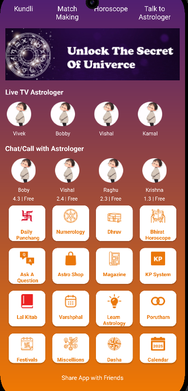
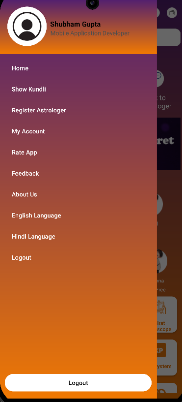

# 🌌 Astro Help Me

**Astro Help Me** is an intuitive and feature-rich Android application designed to provide astrological insights and personalized horoscopes. It serves as a bridge between users and professional astrologers, offering a seamless and insightful astrological experience.

---

## 🚀 Features

- 🪐 **Daily Horoscope**: Get personalized daily predictions.
- 🔮 **Live Chat with Astrologers**: Connect with expert astrologers for real-time guidance.
- 📊 **Detailed Birth Charts**: Generate and analyze comprehensive astrological charts.
- 🔔 **Notifications**: Stay updated with regular astrological updates and insights.
- 🌟 **User-Friendly Interface**: Modern and intuitive design for easy navigation.

---

## 📸 Screenshots

| Home Screen                              | Horoscope Screen                        | Live Chat                                   |
| ---------------------------------------- | --------------------------------------- | ------------------------------------------- |
|  |  |  |

---

## 🛠️ Tech Stack

- **Language**: Kotlin
- **Framework**: Android SDK
- **Architecture**: MVVM (Model-View-ViewModel)
- **Backend**: Firebase
- **Other Tools**: Retrofit, Glide, Room Database

---

### How to Use

1. Copy this text and paste it into a file named `README.md` in your GitHub repository.
2. Replace placeholders like email, screenshots, or links with your actual details.

Would you like help customizing this further?

## ⚙️ Installation

1. Clone the repository::
   ```bash
   git clone https://github.com/shubhamdevgupta/Astro-Help-Me.git
   ```
